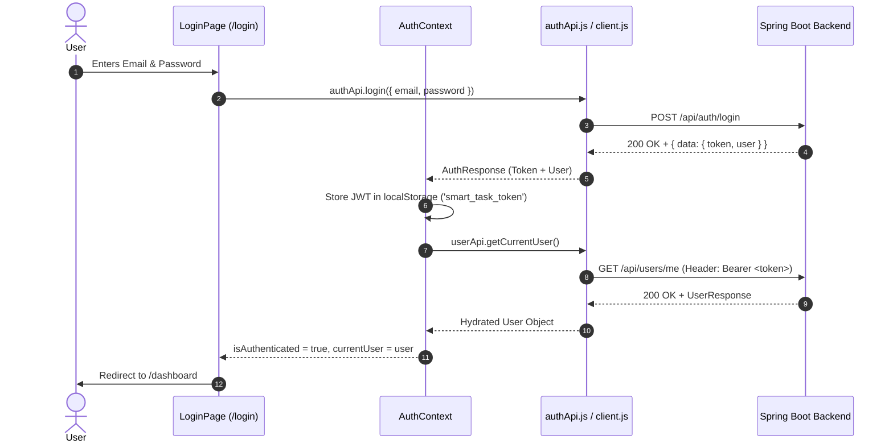

# Smart Task Flow — Frontend Architecture Specification

This document defines the frontend architecture for **Smart Task Flow**, built around the existing Spring Boot backend implementation documented in [API_INTEGRATION_MAP.md](file:///d:/portfolioHrishi/smart-task-management-system/API_INTEGRATION_MAP.md).

---

## 1. Project Directory Structure

The frontend application follows a modular, component-based architecture using React + Vite.

```
frontend/src/
├── api/                        # Centralized API service modules
│   ├── client.js               # Centralized Fetch-based API client with request/response handling
│   ├── authApi.js              # Authentication endpoints (/api/auth/*)
│   ├── userApi.js              # User endpoints (/api/users/*)
│   ├── projectApi.js           # Project endpoints (/api/projects/*)
│   ├── taskApi.js              # Task endpoints (/api/projects/*/tasks, /api/tasks/*)
│   ├── commentApi.js           # Comment endpoints (/api/tasks/*/comments, /api/comments/*)
│   └── notificationApi.js      # Notification endpoints (/api/notifications/*)
│
├── components/                 # Reusable UI components
│   ├── common/                 # Base visual components (Button, Input, Modal, Drawer, etc.)
│   ├── layout/                 # Main App Shell (Navbar, Sidebar, TopHeader, NotificationPopover)
│   ├── auth/                   # Auth components (LoginForm, RegisterForm)
│   ├── dashboard/              # Dashboard widgets (StatsCard, RecentTasksList, ProjectQuickGrid)
│   ├── projects/               # Project components (ProjectCard, CreateProjectModal, EditProjectModal, MemberManagementModal)
│   ├── tasks/                  # Task & Kanban (KanbanBoard, KanbanColumn, TaskCard, TaskDetailModal, CreateTaskModal)
│   ├── comments/               # Comment components (CommentList, CommentItem, AddCommentBox)
│   ├── notifications/          # Notification components (NotificationList, NotificationItem)
│   └── profile/                # Read-only user profile display card
│
├── pages/                      # Top-level Page views (Mapped to Routes)
│   ├── auth/
│   │   ├── LoginPage.jsx
│   │   └── RegisterPage.jsx
│   ├── dashboard/
│   │   └── DashboardPage.jsx
│   ├── projects/
│   │   ├── ProjectsPage.jsx
│   │   └── ProjectDetailPage.jsx
│   ├── tasks/
│   │   └── MyTasksPage.jsx
│   ├── notifications/
│   │   └── NotificationsPage.jsx
│   └── profile/
│       └── ProfilePage.jsx
│
├── hooks/                      # Custom React Hooks
│   ├── useAuth.js              # Access AuthContext
│   ├── useProjects.js          # Project fetching & mutation hook
│   ├── useTasks.js             # Task management & Kanban board state hook
│   ├── useMyTasks.js           # Isolated hook for My Tasks aggregation
│   ├── useComments.js          # Task comments REST hook
│   ├── useNotifications.js     # Notification list & polling hook
│   └── useDebounce.js          # Search input debouncing helper hook
│
├── context/                    # React Context providers for global state
│   ├── AuthContext.jsx         # User session, JWT state, login/logout functions
│   └── AppContext.jsx          # Unread notifications count, theme, global toasts
│
├── routes/                     # Router configuration & protection guards
│   ├── AppRoutes.jsx           # React Router route definitions
│   └── ProtectedRoute.jsx      # Auth guard wrapping protected pages
│
├── utils/                      # Pure helper utilities
│   ├── dateUtils.js            # Date formatting (e.g. "Aug 11, 2026", "2 hours ago")
│   ├── statusUtils.js          # Status & priority display mapping helpers
│   └── storageUtils.js         # LocalStorage read/write wrappers
│
├── constants/                  # Application enums and constant values
│   ├── apiRoutes.js            # Endpoint paths mapping
│   └── appConstants.js         # Enum values (TaskStatus, TaskPriority, ProjectStatus, ProjectRole)
│
├── styles/                     # CSS stylesheets & theme tokens
│   ├── index.css               # Global Reset & Approved Smart Task Flow Design System variables
│   └── components.css          # Component styles based on approved design system
│
└── assets/                     # Static media assets, SVG icons, logo assets
```

### Architecture Justification
* **Modular API Layer (`src/api/`)**: Isolates raw HTTP calls from React components, enabling clean separation of concerns and consistent header/error management.
* **Fetch API Native Implementation**: Uses the native browser Fetch API directly without introducing external HTTP libraries like Axios.
* **Feature-based Component Subdirectories (`src/components/`)**: Keeps components organized per domain as the UI scales with Kanban, Comments, and Notifications.
* **Separation of Pages and Components (`src/pages/`)**: Pages act as route handlers that compose containers and presentational components.

---

## 2. API Client Architecture

All API calls flow through a single centralized Fetch-based API client defined in `src/api/client.js`.

### Technical Design:
1. **Base URL Resolution**:
   ```javascript
   const BASE_URL = import.meta.env.VITE_API_BASE_URL || '/api';
   ```
2. **Native Fetch Request Wrapper**:
   - Outgoing requests use `window.fetch`.
   - Headers automatically attach `Content-Type: application/json`.
   - If a JWT token exists in `localStorage` under key `smart_task_token`, attach header:
     `Authorization: Bearer <token>`
3. **Response Normalization**:
   - Handles standard `ApiResponse<T>` (`{ success, status, message, data, timestamp }`).
   - Normalizes raw responses (such as `GET /api/users/me` returning `UserResponse` directly).
4. **Centralized Error Handling**:
   - Converts non-2xx responses into structured JavaScript Error objects carrying:
     - `status`: HTTP status code (400, 401, 403, 404, 409, 500)
     - `message`: Main error string
     - `errors`: Array of validation error details (if present)
   - Automatically handles `401 Unauthorized`:
     - Clears token from `localStorage`.
     - Dispatches a custom window event (`auth:unauthorized`) to trigger AuthContext to reset user state and redirect to `/login`.

---

## 3. Authentication & Security Architecture

### Authentication Flow:


### Logout Flow:
1. User clicks "Logout" in Navbar or User Profile menu.
2. `AuthContext.logout()` is called.
3. Key `smart_task_token` is removed from `localStorage`.
4. State is reset (`currentUser = null`, `isAuthenticated = false`).
5. App redirects user to `/login`.

### Security & Token Guidelines:
* **JWT Storage**: In this version, JWT may be stored in `localStorage` under key `smart_task_token` for session persistence across tab refreshes.
* **No Password Storage**: Passwords are sent directly over HTTPS during authentication and are **never** stored in `localStorage`, `sessionStorage`, React context, or component state.
* **Token Exposure Prevention**: JWT tokens are **never** logged to `console.log`, printed in error messages, or passed via URL parameters.
* **HTTPS**: Production environments must enforce HTTPS for transport-layer security.
* **Backend Authorization Authority**: The Spring Boot backend remains the sole authority for authentication and authorization enforcement.

---

## 4. Routing Architecture

Defined in `src/routes/AppRoutes.jsx` using `react-router-dom`.

| Route | Component | Guard Type | Description |
| :--- | :--- | :--- | :--- |
| `/login` | `LoginPage` | Public (Guest only) | User authentication view. Redirects to `/dashboard` if already logged in. |
| `/register` | `RegisterPage` | Public (Guest only) | User registration view. Redirects to `/dashboard` if already logged in. |
| `/dashboard` | `DashboardPage` | **Protected** | Default workspace overview displaying actual backend metrics & shortcuts. |
| `/projects` | `ProjectsPage` | **Protected** | Accessible projects listing with search, filter, and "Create Project" modal. |
| `/projects/:projectId` | `ProjectDetailPage` | **Protected** | Project workspace featuring Kanban Board, Task List, Project Settings, Member Management. |
| `/projects/:projectId/tasks/:taskId` | `ProjectDetailPage` | **Protected** | Project workspace with auto-opened Task Detail Modal for direct task deep-linking. |
| `/my-tasks` | `MyTasksPage` | **Protected** | Aggregated view of tasks assigned to current user (derived via project task queries). |
| `/notifications` | `NotificationsPage` | **Protected** | Full-page notification management center with mark-all-read actions. |
| `/profile` | `ProfilePage` | **Protected** | Read-only profile view showing Name, Email, and Global Role. |
| `*` | `NotFoundPage` | Public | 404 Fallback page redirecting users to `/dashboard` or `/login`. |

---

## 5. Authorization & Role-Based UX Checks

The backend defines two levels of roles:
* **Global Application Roles**: `ADMIN`, `USER`
* **Project Roles**: `OWNER`, `ADMIN`, `MEMBER`, `VIEWER`

### UX Enforcement Policy:
* **UX Only**: Frontend role checks exist exclusively for User Experience (UX)—e.g., hiding or disabling action buttons (like "Edit Project", "Add Member", "Delete Task") when the user does not possess the requisite role.
* **Not Security**: Frontend checks are **never** treated as security boundaries. The backend is the sole authority for enforcing authorization rules and will return `403 Forbidden` if an unauthorized action is attempted.
* **No Invented Permissions**: The frontend strictly mirrors the existing backend role models without inventing custom client-only permission rules.

---

## 6. State Management Strategy & Data Fetching Policy

No external state management or server-state library (like Redux, TanStack Query, or SWR) is introduced. State is managed cleanly using **React Context** and **Local Component State**.

### Global State (React Context):

1. **`AuthContext`**:
   - `currentUser`: `{ id, name, email, role } | null`
   - `token`: `string | null`
   - `isAuthenticated`: `boolean`
   - `isLoading`: `boolean` (initial session hydration check)
   - Methods: `login(credentials)`, `register(data)`, `logout()`, `refreshUser()`

2. **`AppContext`**:
   - `unreadNotificationCount`: `number`
   - `activeProjectId`: `number | null`
   - `toasts`: Array of `{ id, type, title, message }` for user feedback
   - Methods: `addToast()`, `removeToast()`, `fetchUnreadCount()`

### Local Component State & Efficient Fetching:
* **Dashboard Data Reuse**: To prevent duplicate API requests, the dashboard page fetches projects and tasks once and shares the data across child widgets (`StatsCard`, `RecentTasksList`, `ProjectQuickGrid`). No repeated, redundant network calls are triggered per widget.
* **Kanban Board**: Dragged task ID, column status filter, search keyword, priority filter.
* **Forms**: Draft inputs, validation error messages (`title`, `description`, `dueDate`).
* **Modals & Drawers**: `isCreateTaskOpen`, `isEditProjectOpen`, `isAddMemberOpen`, `selectedTaskId`.

---

## 7. API-to-UI Mapping

| Backend REST Endpoint | API Module Method | Custom Hook / Context | Consuming React Page / Component |
| :--- | :--- | :--- | :--- |
| `POST /api/auth/register` | `authApi.register()` | `useAuth()` | `RegisterPage` (`RegisterForm`) |
| `POST /api/auth/login` | `authApi.login()` | `useAuth()` | `LoginPage` (`LoginForm`) |
| `GET /api/users/me` | `userApi.getCurrentUser()` | `useAuth()` | `AuthContext`, `TopHeader`, `ProfilePage` |
| `POST /api/projects` | `projectApi.createProject()` | `useProjects()` | `ProjectsPage` (`CreateProjectModal`) |
| `GET /api/projects` | `projectApi.listProjects()` | `useProjects()` | `ProjectsPage`, `Sidebar`, `DashboardPage` |
| `GET /api/projects/{id}` | `projectApi.getProject()` | `useProjects()` | `ProjectDetailPage` |
| `PUT /api/projects/{id}` | `projectApi.updateProject()` | `useProjects()` | `ProjectDetailPage` (`EditProjectModal`) |
| `DELETE /api/projects/{id}` | `projectApi.deleteProject()` | `useProjects()` | `ProjectDetailPage` (`ConfirmDialog`) |
| `POST /api/projects/{id}/members` | `projectApi.addMember()` | `useProjects()` | `ProjectDetailPage` (`MemberManagementModal`) |
| `DELETE /api/projects/{id}/members/{uId}` | `projectApi.removeMember()` | `useProjects()` | `ProjectDetailPage` (`MemberList`) |
| `POST /api/projects/{id}/tasks` | `taskApi.createTask()` | `useTasks()` | `ProjectDetailPage` (`CreateTaskModal`) |
| `GET /api/projects/{id}/tasks` | `taskApi.listTasks()` | `useTasks()`, `useMyTasks()` | `ProjectDetailPage` (`KanbanBoard`, `TaskListView`), `DashboardPage`, `MyTasksPage` |
| `GET /api/tasks/{taskId}` | `taskApi.getTask()` | `useTasks()` | `TaskDetailModal` |
| `PUT /api/tasks/{taskId}` | `taskApi.updateTask()` | `useTasks()` | `TaskDetailModal` (`EditTaskForm`) |
| `DELETE /api/tasks/{taskId}` | `taskApi.deleteTask()` | `useTasks()` | `TaskDetailModal`, `TaskCard` |
| `PATCH /api/tasks/{taskId}/assignee` | `taskApi.changeAssignee()` | `useTasks()` | `TaskCard` (Quick Assign), `TaskDetailModal` |
| `PATCH /api/tasks/{taskId}/status` | `taskApi.changeStatus()` | `useTasks()` | `KanbanBoard` (Drag Drop), `TaskDetailModal` |
| `PATCH /api/tasks/{taskId}/priority` | `taskApi.changePriority()` | `useTasks()` | `TaskCard`, `TaskDetailModal` |
| `PATCH /api/tasks/{taskId}/due-date` | `taskApi.updateDueDate()` | `useTasks()` | `TaskCard`, `TaskDetailModal` |
| `POST /api/tasks/{taskId}/comments` | `commentApi.createComment()` | `useComments()` | `TaskDetailModal` (`AddCommentBox`) |
| `GET /api/tasks/{taskId}/comments` | `commentApi.getComments()` | `useComments()` | `TaskDetailModal` (`CommentList`) |
| `PUT /api/comments/{commentId}` | `commentApi.updateComment()` | `useComments()` | `CommentItem` (Inline Edit) |
| `DELETE /api/comments/{commentId}` | `commentApi.deleteComment()` | `useComments()` | `CommentItem` (Delete Action) |
| `GET /api/notifications` | `notificationApi.getNotifications()` | `useNotifications()` | `NotificationPopover`, `NotificationsPage` |
| `GET /api/notifications/unread-count` | `notificationApi.getUnreadCount()` | `AppContext` | `TopHeader` (Notification Badge) |
| `PUT /api/notifications/{id}/read` | `notificationApi.markAsRead()` | `useNotifications()` | `NotificationItem` |
| `PUT /api/notifications/read-all` | `notificationApi.markAllAsRead()` | `useNotifications()` | `NotificationPopover`, `NotificationsPage` |
| `DELETE /api/notifications/{id}` | `notificationApi.deleteNotification()` | `useNotifications()` | `NotificationItem` |

---

## 8. Error Handling Strategy

The backend communicates failures via `ErrorResponse` (`status`, `message`, `errors`).

```typescript
interface ErrorResponse {
  success: false;
  status: number;
  message: string;
  timestamp: string;
  errors?: string[];
}
```

### Consistent Frontend Strategy:
1. **400 Bad Request (Validation Errors)**:
   - Handled inside forms (`LoginForm`, `RegisterForm`, `TaskForm`, `ProjectForm`).
   - Maps field errors (`"email: Please provide a valid email address"`) to input error messages.
2. **401 Unauthorized (Expired or Invalid Token)**:
   - Clears `smart_task_token` from `localStorage`.
   - Triggers user session clear in `AuthContext`.
   - Redirects user to `/login` with toast notification: `"Session expired. Please log in again."`
3. **403 Forbidden**:
   - Triggers error toast: `"Access Denied: You do not have permission to perform this action."`
4. **404 Not Found**:
   - Renders the inline `ErrorState` component with a `"Resource not found"` message and return button.
5. **409 Conflict**:
   - Displays inline alert in relevant modal (e.g. `"Email is already registered"` or `"Member is already in this project"`).
6. **500 Server Error & Network Failure**:
   - Triggers error toast: `"Network connection error. Please verify the backend server is running."`

---

## 9. Loading, Empty, and Error States

Every API-driven component must define four states without generating fake content:

* **Loading State**: Displays clean skeleton loaders or button spinner indicators during active requests.
* **Empty State**: Rendered when an API returns `[]` data using `<EmptyState title="..." description="..." icon="..." actionButton="..." />`.
* **Error State**: Rendered on request failure using `<ErrorState message="..." onRetry={refetchFunction} />`.
* **Populated State**: Renders actual data received from backend REST endpoints.

---

## 10. Atomic Component Library Architecture

To avoid duplicating UI elements, the frontend defines reusable components in `src/components/common/`:

* **`Button`**: Standard button with primary, secondary, danger, outline, and ghost variants; supports `loading` spinner and icons.
* **`Input`**: Text/email/password input with label, helper text, error message, and prefix/suffix icons.
* **`Select`**: Dropdown select for status, priority, and role fields.
* **`Modal`**: Accessible dialog overlay with header, body, footer, backdrop overlay, and ESC key handler.
* **`Drawer`**: Right slide-over panel for task details.
* **`Avatar`**: User initials / avatar badge with configurable size.
* **`Badge`**: Generic metadata tag pill.
* **`StatusBadge`**: Pill component for `TaskStatus` (`TODO`, `IN_PROGRESS`, `IN_REVIEW`, `DONE`) and `ProjectStatus`.
* **`PriorityBadge`**: Pill component for `TaskPriority` (`LOW`, `MEDIUM`, `HIGH`, `URGENT`).
* **`LoadingSpinner`**: SVG spinning loader.
* **`EmptyState`**: Centered container displaying an icon, title, description, and optional action CTA.
* **`ErrorState`**: Error message container with a retry button.
* **`ConfirmDialog`**: Confirmation modal for destructive actions (e.g. Delete Project, Delete Task).
* **`Toast`**: Notification alert banner for global feedback messages.
* **`SearchInput`**: Input field with search icon and clear button.
* **`ProgressBar`**: Project completion percentage bar calculated from actual task completion ratios.

---

## 11. Visual Design Policy & Design System

* **Official Design System**: All visual aesthetics, colors, typography, spacing, borders, radii, component patterns, and responsive breakpoints strictly adhere to [SMART_TASK_FLOW_DESIGN_SYSTEM.md](file:///d:/portfolioHrishi/smart-task-management-system/SMART_TASK_FLOW_DESIGN_SYSTEM.md).
* **Strict Avoidance of Generic AI Trends**: Generic AI/SaaS design tropes (such as indiscriminate glassmorphism, purple/blue AI glow gradients, glowing card borders, or arbitrary card rounding) are **strictly forbidden**.
* **Source of Truth**: All component implementations must consume CSS variables and component tokens defined in `SMART_TASK_FLOW_DESIGN_SYSTEM.md`.

---

## 12. Backend Limitations & Frontend Technical Solutions

| Backend Limitation | Architectural Solution in Frontend |
| :--- | :--- |
| **No Global User Search API** | For Task Assignment: Populates assignee dropdown strictly from `project.members`.<br>For Add Member: Requires entering the user's exact email address in `AddProjectMemberRequest`. |
| **No Profile Update API** | The `ProfilePage` is strictly **read-only** displaying the authenticated user's Name, Email, and Global Role from `GET /api/users/me`. No editable form fields are rendered. Profile editing is documented as a future backend enhancement. |
| **No Standalone My Tasks API** | Handled in `useMyTasks` hook: Fetches accessible projects (`GET /api/projects`), queries tasks for each project (`GET /api/projects/{id}/tasks`) in controlled calls, and filters tasks locally where `task.assignee.id === currentUser.id`. Isolated for clean future replacement if `GET /api/tasks/my-tasks` is added to backend. |
| **No Realtime Comment Infrastructure** | Comments operate exclusively via standard REST APIs (`GET`, `POST`, `PUT`, `DELETE`). Following any comment mutation, the frontend refetches the task's comment list or updates local state from the API response payload. Realtime sync is not implemented. |
| **No Standalone Activity / Audit Feed API** | Audit/Activity feeds will not be fabricated using `task.updatedAt` or notification streams. Documented as a future backend feature request. |
| **No WebSockets / SSE Infrastructure** | Notification unread count and board updates rely on initial fetch, action-triggered refetches (e.g. marking read, dragging task), and optional controlled polling at 30-second intervals. No WebSockets/SSE code will be created. |
| **`GET /api/users/me` Response Shape Difference** | API client checks if response contains `.data` wrapper; if not, parses the direct `UserResponse` object seamlessly. |

---

## 13. Environment & Deployment Strategy

* **Development Configuration (`.env`)**:
  ```env
  VITE_API_BASE_URL=http://localhost:8080
  ```
* **Environment Template (`.env.example`)**:
  ```env
  VITE_API_BASE_URL=
  ```
* **Production Deployment**:
  - Build command: `npm run build`
  - Output static bundle in `frontend/dist/`.
  - Production environment variable `VITE_API_BASE_URL=<deployed-backend-url>`.
