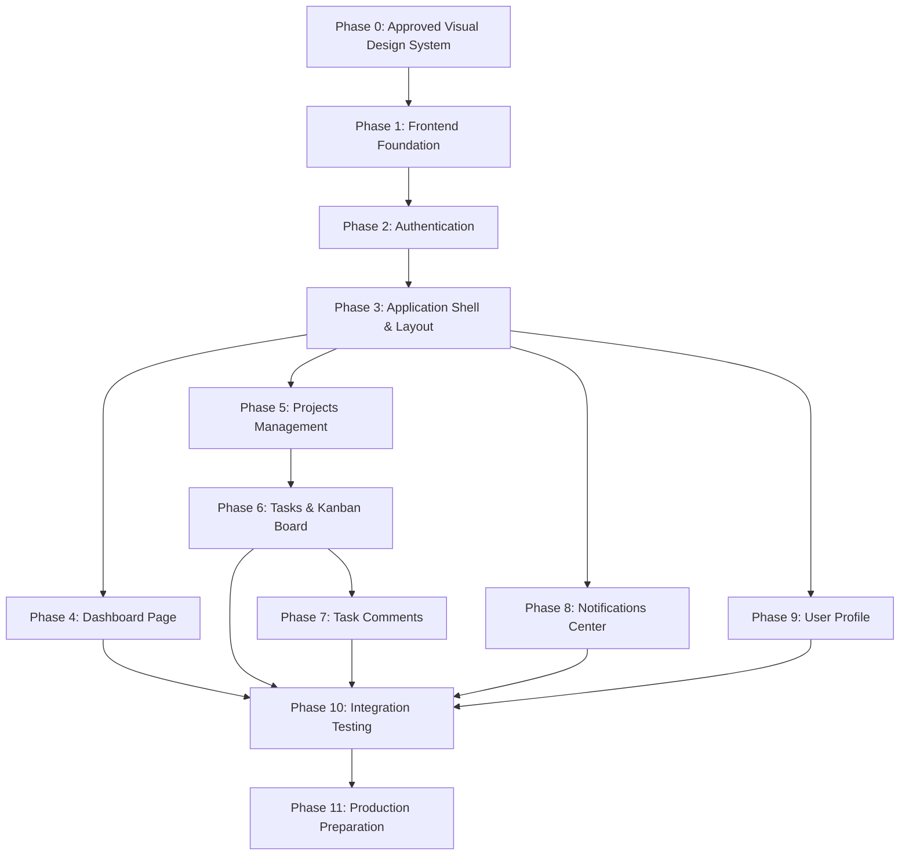

# Smart Task Flow — Frontend Implementation Plan

This implementation plan outlines the step-by-step roadmap for building the frontend of **Smart Task Flow** around the existing Spring Boot backend.

---

## Phase Overview & Roadmap

---

## Phase 0 — Approved Visual Design System

### Overview
Define all visual design tokens, colors, typography, spacing, border radii, navigation styles, component aesthetics, and micro-interactions in CSS based strictly on the **Approved Smart Task Flow Design System** specification and visual assets before page implementation begins. Avoid generic unapproved AI dark/glow trends.

### Files & Components to Create/Update
* `frontend/src/styles/index.css` (Design tokens, CSS variables, typography, reset)
* `frontend/src/styles/components.css` (Approved component utility classes)

### APIs Used
* None

### Dependencies Needed
* None

### Acceptance Criteria
1. CSS variable design tokens established for colors, background, surface, text hierarchy, borders, radii, and shadows based on approved design guidelines.
2. Architecture remains visually neutral and modular until design tokens are loaded.
3. No generic AI glowing borders, glassmorphic overuse, or unapproved purple/blue gradient patterns.

---

## Phase 1 — Frontend Foundation

### Overview
Establish project foundation, environment configuration, utility helpers, centralized Fetch-based API client core (`client.js`), and basic atomic UI components (`Button`, `Input`, `Select`, `Badge`, `StatusBadge`, `PriorityBadge`, `LoadingSpinner`, `EmptyState`, `ErrorState`, `Toast`). Uses native browser Fetch API (no Axios dependency).

### Files & Components to Create/Update
* `frontend/.env` & `frontend/.env.example`
* `frontend/src/utils/dateUtils.js`
* `frontend/src/utils/statusUtils.js`
* `frontend/src/utils/storageUtils.js`
* `frontend/src/constants/apiRoutes.js`
* `frontend/src/constants/appConstants.js`
* `frontend/src/api/client.js`
* `frontend/src/components/common/Button.jsx`
* `frontend/src/components/common/Input.jsx`
* `frontend/src/components/common/Select.jsx`
* `frontend/src/components/common/Badge.jsx`
* `frontend/src/components/common/StatusBadge.jsx`
* `frontend/src/components/common/PriorityBadge.jsx`
* `frontend/src/components/common/LoadingSpinner.jsx`
* `frontend/src/components/common/EmptyState.jsx`
* `frontend/src/components/common/ErrorState.jsx`
* `frontend/src/components/common/Toast.jsx`

### APIs Used
* None (Foundation & Component primitives)

### Dependencies Needed
* `react-router-dom` (Routing engine)
* `lucide-react` (Icons)

### Acceptance Criteria
1. Environment variables configured (`VITE_API_BASE_URL=http://localhost:8080`).
2. Centralized Fetch client (`client.js`) correctly attaches `Content-Type: application/json` and `Authorization: Bearer <token>` when key `smart_task_token` is present in `localStorage`.
3. Native `window.fetch` is used without adding Axios or external HTTP libraries.
4. Handles `401 Unauthorized` responses by clearing token and notifying AuthContext.
5. Base UI components (`Button`, `Input`, `StatusBadge`, `PriorityBadge`, `LoadingSpinner`, `EmptyState`) render properly.

---

## Phase 2 — Authentication

### Overview
Build authentication state management (`AuthContext`), JWT storage in `localStorage`, login page, and registration page.

### Files & Components to Create/Update
* `frontend/src/api/authApi.js`
* `frontend/src/api/userApi.js`
* `frontend/src/context/AuthContext.jsx`
* `frontend/src/hooks/useAuth.js`
* `frontend/src/components/auth/LoginForm.jsx`
* `frontend/src/components/auth/RegisterForm.jsx`
* `frontend/src/pages/auth/LoginPage.jsx`
* `frontend/src/pages/auth/RegisterPage.jsx`

### APIs Used
* `POST /api/auth/login`
* `POST /api/auth/register`
* `GET /api/users/me`

### Dependencies Needed
* None additional

### Acceptance Criteria
1. User can register with name, email, and password. Validation errors (e.g. email exists) display cleanly.
2. User can log in with valid credentials and receive a JWT token.
3. JWT is saved in `localStorage` under `smart_task_token` for session persistence.
4. `AuthContext` hydrates session by calling `GET /api/users/me` on application load.
5. Passwords are never saved in storage or React state after the login call completes.

---

## Phase 3 — Application Shell & Navigation

### Overview
Construct the main app shell, navigation sidebar, top header bar, notification popover entry point, router setup, and protected route guards.

### Files & Components to Create/Update
* `frontend/src/routes/AppRoutes.jsx`
* `frontend/src/routes/ProtectedRoute.jsx`
* `frontend/src/context/AppContext.jsx`
* `frontend/src/components/layout/AppShell.jsx`
* `frontend/src/components/layout/Navbar.jsx`
* `frontend/src/components/layout/Sidebar.jsx`
* `frontend/src/components/layout/TopHeader.jsx`
* `frontend/src/components/common/Avatar.jsx`
* `frontend/src/pages/NotFoundPage.jsx`

### APIs Used
* `GET /api/users/me`
* `GET /api/notifications/unread-count`

### Dependencies Needed
* None additional

### Acceptance Criteria
1. Unauthenticated users attempting to visit protected routes (`/dashboard`, `/projects`, etc.) are redirected to `/login`.
2. Authenticated users attempting to visit `/login` or `/register` are redirected to `/dashboard`.
3. App layout displays sidebar navigation and top header showing user initials and unread notification badge.
4. Frontend role checks are used strictly for UX (hiding/disabling actions); backend remains the sole authorization authority.

---

## Phase 4 — Dashboard Page

### Overview
Create the main home dashboard showing task metrics, project quick links, and recent assigned tasks. All metrics are calculated dynamically from actual backend responses. Data is shared across dashboard widgets to avoid duplicate API requests without adding third-party server-state libraries.

### Files & Components to Create/Update
* `frontend/src/pages/dashboard/DashboardPage.jsx`
* `frontend/src/components/dashboard/StatsCard.jsx`
* `frontend/src/components/dashboard/RecentTasksList.jsx`
* `frontend/src/components/dashboard/ProjectQuickGrid.jsx`

### APIs Used
* `GET /api/projects`
* `GET /api/projects/{projectId}/tasks`

### Dependencies Needed
* None additional

### Acceptance Criteria
1. Calculates Total Projects directly from `GET /api/projects` response length.
2. Calculates Assigned Tasks, Completed Tasks (`status === 'DONE'`), and Overdue Tasks (`dueDate < now` and status !== `DONE`) from actual returned task data.
3. Reuses fetched project and task data across widgets to prevent duplicate network calls.
4. Displays loading skeleton while querying APIs.

---

## Phase 5 — Project Management

### Overview
Build project listing view, project creation modal, project detail view, project settings modal, project status updates, and team member management.

### Files & Components to Create/Update
* `frontend/src/api/projectApi.js`
* `frontend/src/hooks/useProjects.js`
* `frontend/src/pages/projects/ProjectsPage.jsx`
* `frontend/src/pages/projects/ProjectDetailPage.jsx`
* `frontend/src/components/projects/ProjectCard.jsx`
* `frontend/src/components/projects/CreateProjectModal.jsx`
* `frontend/src/components/projects/EditProjectModal.jsx`
* `frontend/src/components/projects/MemberManagementModal.jsx`
* `frontend/src/components/projects/MemberList.jsx`
* `frontend/src/components/common/ConfirmDialog.jsx`

### APIs Used
* `GET /api/projects`
* `POST /api/projects`
* `GET /api/projects/{projectId}`
* `PUT /api/projects/{projectId}`
* `DELETE /api/projects/{projectId}`
* `POST /api/projects/{projectId}/members`
* `DELETE /api/projects/{projectId}/members/{userId}`

### Dependencies Needed
* None additional

### Acceptance Criteria
1. User can list accessible projects and create new projects.
2. User can view project details, status, owner, and member list.
3. Project owner/admin can edit project title, description, and status (`ACTIVE`, `COMPLETED`, `ARCHIVED`).
4. Project owner/admin can add team members by exact email and assign roles (`OWNER`, `ADMIN`, `MEMBER`, `VIEWER`).
5. Project owner/admin can remove members from a project.

---

## Phase 6 — Tasks & Kanban Board

### Overview
Implement task creation modal, task list view, interactive Kanban board view (`TODO`, `IN_PROGRESS`, `IN_REVIEW`, `DONE`), drag-and-drop status updates, priority changes, assignee selection (from project members), task detail drawer, and `MyTasksPage` (using an isolated `useMyTasks` hook).

### Files & Components to Create/Update
* `frontend/src/api/taskApi.js`
* `frontend/src/hooks/useTasks.js`
* `frontend/src/hooks/useMyTasks.js`
* `frontend/src/components/tasks/KanbanBoard.jsx`
* `frontend/src/components/tasks/KanbanColumn.jsx`
* `frontend/src/components/tasks/TaskCard.jsx`
* `frontend/src/components/tasks/TaskDetailModal.jsx`
* `frontend/src/components/tasks/CreateTaskModal.jsx`
* `frontend/src/components/tasks/TaskListView.jsx`
* `frontend/src/pages/tasks/MyTasksPage.jsx`

### APIs Used
* `GET /api/projects/{projectId}/tasks`
* `POST /api/projects/{projectId}/tasks`
* `GET /api/tasks/{taskId}`
* `PUT /api/tasks/{taskId}`
* `DELETE /api/tasks/{taskId}`
* `PATCH /api/tasks/{taskId}/status`
* `PATCH /api/tasks/{taskId}/priority`
* `PATCH /api/tasks/{taskId}/assignee`
* `PATCH /api/tasks/{taskId}/due-date`

### Dependencies Needed
* None (or HTML5 Drag and Drop API)

### Acceptance Criteria
1. Tasks render cleanly across 4 Kanban columns (`TODO`, `IN_PROGRESS`, `IN_REVIEW`, `DONE`).
2. Dragging a card triggers `PATCH /api/tasks/{taskId}/status` and updates status instantly.
3. User can create new tasks with title, description, priority, assignee (selected from project members), and due date.
4. `TaskDetailModal` allows full edits, status changes, priority changes, due date updates, and task deletion.
5. `MyTasksPage` aggregates assigned tasks using `useMyTasks` hook without creating mock APIs or unbounded concurrent requests.

---

## Phase 7 — Task Comments

### Overview
Build the task comment thread section inside `TaskDetailModal`, allowing users to view, post, edit, and delete comments on tasks using REST APIs only. After mutations, either refetch the comment list or update local state from the API response payload. Realtime synchronization is not implemented.

### Files & Components to Create/Update
* `frontend/src/api/commentApi.js`
* `frontend/src/hooks/useComments.js`
* `frontend/src/components/comments/CommentList.jsx`
* `frontend/src/components/comments/CommentItem.jsx`
* `frontend/src/components/comments/AddCommentBox.jsx`

### APIs Used
* `GET /api/tasks/{taskId}/comments`
* `POST /api/tasks/{taskId}/comments`
* `PUT /api/comments/{commentId}`
* `DELETE /api/comments/{commentId}`

### Dependencies Needed
* None additional

### Acceptance Criteria
1. Opening `TaskDetailModal` fetches and displays all comments for the selected task using REST API `GET`.
2. User can post new comments (`POST`). Successful response updates local state or triggers a refetch.
3. User can edit their own existing comments inline (`PUT`).
4. User can delete their own comments (`DELETE`).
5. Operations rely exclusively on standard REST HTTP calls without WebSockets/SSE.

---

## Phase 8 — Notifications Center

### Overview
Implement top header notification popover, unread notification count badge, notification list, mark as read actions, and full notifications page. Uses initial fetch, action-triggered refetches, and optional 30-second polling (no WebSockets/SSE).

### Files & Components to Create/Update
* `frontend/src/api/notificationApi.js`
* `frontend/src/hooks/useNotifications.js`
* `frontend/src/components/notifications/NotificationPopover.jsx`
* `frontend/src/components/notifications/NotificationList.jsx`
* `frontend/src/components/notifications/NotificationItem.jsx`
* `frontend/src/pages/notifications/NotificationsPage.jsx`

### APIs Used
* `GET /api/notifications`
* `GET /api/notifications/unread-count`
* `PUT /api/notifications/{notificationId}/read`
* `PUT /api/notifications/read-all`
* `DELETE /api/notifications/{notificationId}`

### Dependencies Needed
* None additional

### Acceptance Criteria
1. Top bar displays unread notification badge.
2. Clicking notification bell opens `NotificationPopover`.
3. Clicking a notification marks it as read (`PUT /read`) and updates badge count.
4. "Mark All as Read" marks all notifications read.
5. User can delete individual notifications.
6. Refreshes periodically (e.g. 30s) or upon user action without WebSockets.

---

## Phase 9 — User Profile

### Overview
Build user profile view displaying read-only account information (Name, Email, Global Role) obtained from `GET /api/users/me`. Does not include editable form fields.

### Files & Components to Create/Update
* `frontend/src/pages/profile/ProfilePage.jsx`
* `frontend/src/components/profile/ProfileCard.jsx`

### APIs Used
* `GET /api/users/me`

### Dependencies Needed
* None additional

### Acceptance Criteria
1. Profile page displays read-only user details retrieved from `/api/users/me`.
2. Displays Name, Email, and assigned global application role (`ADMIN` or `USER`).
3. Does not present editable form fields since no profile update endpoint currently exists in backend.

---

## Phase 10 — Integration Testing & Edge Case Verification

### Overview
Verify end-to-end user flows, test error handling (400, 401, 403, 404, 409, 500), check responsive design on desktop/tablet/mobile, and audit performance.

### Activities
* Test full registration → login → project creation → member addition → task creation → drag-and-drop status update → commenting → notification delivery flow.
* Verify 401 token expiration handling auto-redirects to `/login`.
* Verify error state banners render properly when backend is unreachable.

### Acceptance Criteria
1. Zero console errors or unhandled promise rejections.
2. Form validation messages correctly highlight problematic fields.
3. Clean user feedback via toasts for network actions.

---

## Phase 11 — Production Preparation

### Overview
Optimize Vite build configuration, verify environment variable handling, update `README.md`.

### Activities & Files to Create/Update
* Update `frontend/vite.config.js` (Proxy setup for dev, build optimization).
* Update root `README.md` with frontend startup commands (`npm run dev`, `npm run build`).

### Acceptance Criteria
1. `npm run build` executes without warnings or errors.
2. Production bundle generated in `frontend/dist/`.
